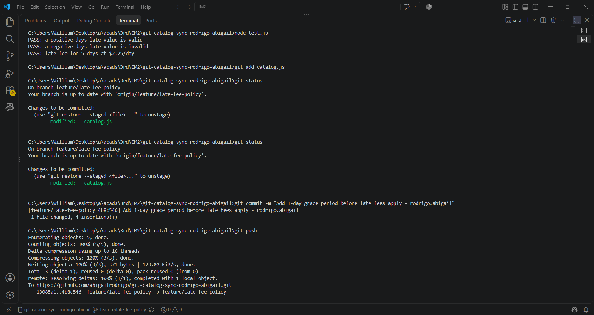
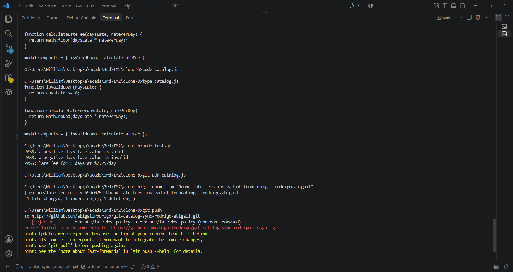
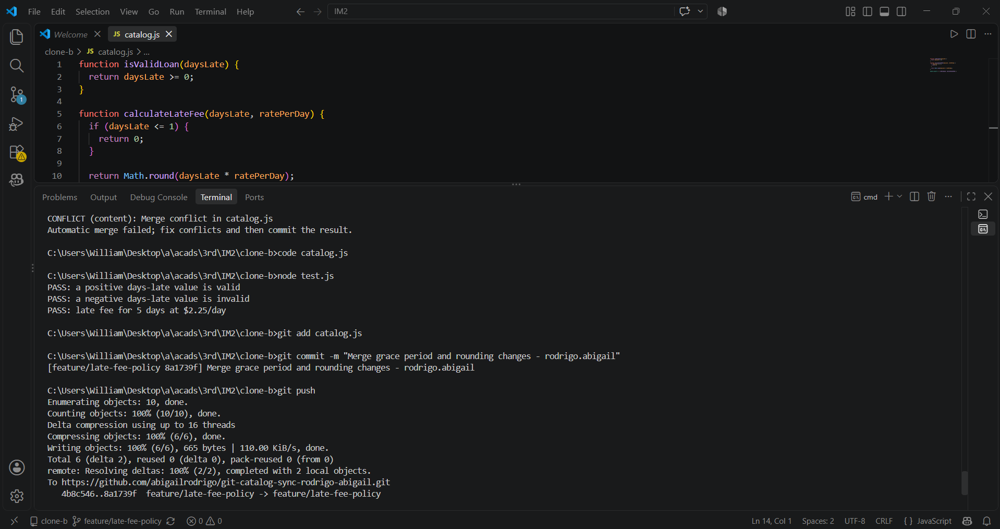
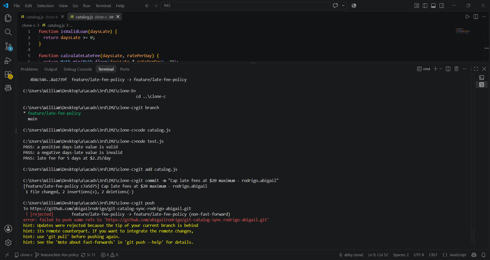
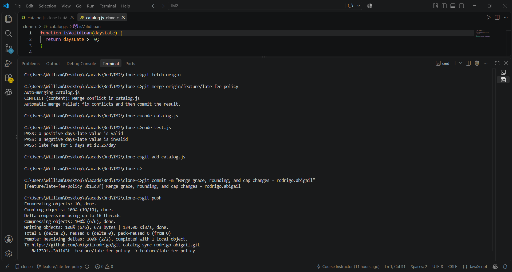
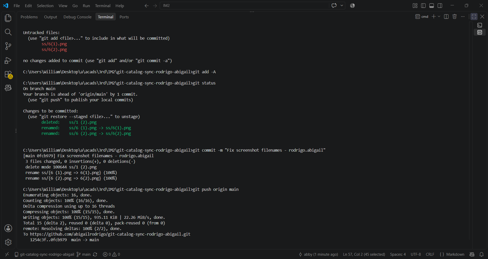

Git Catalog Sync Workflow

1. Final Late-Fee Behavior
The final calculateLateFee function has all four changes:

        function calculateLateFee(daysLate, ratePerDay) {
        if (daysLate <= 1) {
            return 0;
        }

        return Math.max(1, Math.min(Math.round(daysLate * ratePerDay), 20));
        }

The changes were made by:
- Clone A: Added a 1-day grace period, so there is no fee if the loan is 1 day late or less.
- Clone B: Changed the calculation from Math.floor() to Math.round() so the fee is rounded.
- Clone C: Added a maximum fee of $20.
- Clone A: Added a minimum fee of $1 after the grace period.

2. Task 3 and Task 5 Conflicts
- Task 3 had a two-way conflict between Clone A and Clone B. Clone A had the grace period, while Clone B had the rounding change. I fixed the conflict by keeping both changes.
- Task 5 had a three-way conflict because Clone C had the $20 maximum fee, while the remote branch already had the grace period and rounding. I fixed the conflict by keeping all three changes.

3. Task 5 Merge and Task 6 Rebase
- In Task 5, I used git merge to combine Clone C's changes with the updated feature branch. This kept both branch histories together.
- In Task 6, I used git rebase to put Clone A's new minimum-fee change on top of the latest feature branch. I then fixed the conflict so that all four changes were kept.

The main difference is that merge combines the branches, while rebase puts the local commit on top of the latest branch.

4. Team Process Change
One way to prevent all three rejected pushes is to make sure everyone checks for the latest changes before making and pushing their own changes.

The team could use git fetch and update their branch before starting new work. This would help prevent people from working on an old version of the branch.

Screenshots
- Task 1

- Task 2

- Task 3

- Task 4

- Task 5

- Task 6
.png)
.png)

- Task 7

